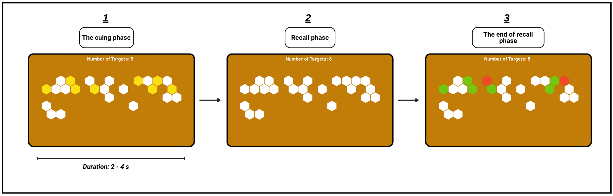

# Clinic B Dataset - CSV Documentation

This folder contains two CSV files with experimental data from Clinic B of a visuospatial working memory study using a serious game called **Honey Memory**.

## About the Honey Memory Game

Honey Memory is a game-based task designed to assess visuospatial working memory in children. The game comprises five difficulty levels, each presenting a spatial memory challenge where participants must memorize and recall the locations of target hexagons on a grid.

### Game Mechanics

- **Cue phase (encoding)**: A set of yellow target hexagons appears briefly on a grid (2-4 seconds depending on difficulty)
- **Recall phase (response)**: The board turns blank, and participants must click all target hexagons in any order
- **Feedback**: Correct selections turn green; incorrect selections turn red
- **Progression**: The difficulty increases progressively across 5 levels (Levels 5, 10, 13, 16, and 18), each defined by:
  - Total number of hexagons on the board
  - Number of target hexagons to memorize
  - Spatial dispersion of targets across the screen

### Study Design

This dataset comes from **Clinic B**, where a custom Python-based implementation of Honey Memory was deployed on a laptop with mouse-based interaction. Clinic B used **fixed spatial patterns** across trials, enabling precise analysis of spatial strategies and movement patterns.

A total of **36 participants** were tested: 25 children diagnosed with ADHD and 11 typically developing controls (ages 7-10). Valid data was collected from **16 ADHD and 20 Control participants**.

### Game Interface

Below is a screenshot of the Honey Memory game interface used in this study:


*Honey Memory trial flow: Cue phase (target hexagons appear), Recall phase (participant selects targets), and Feedback phase.*

---

## Data Files

This folder contains two CSV files with experimental data from Clinic B:

Contains detailed data for each of the 24 trials completed by each participant.

### Columns

| Column | Type | Description |
|--------|------|-------------|
| `participant_id` | string | Unique participant identifier (e.g., "ADHD #5", "Control #12") |
| `level` | integer | Difficulty level of the pattern (ranges from 5 to 26) |
| `trial_number` | integer | Sequential trial number (1-24) |
| `click_correctness_sequence` | list of boolean | Sequence of True/False for each click (True = correct, False = incorrect) |
| `click_response_times_ms` | list of integer | Response times for each click in milliseconds |
| `gray_hex_indices` | list of integer | Indices of disabled/unavailable hexagons in the grid |
| `white_hex_indices` | list of integer | Indices of available but non-target hexagons |
| `target_hex_indices` | list of integer | Indices of the correct target hexagons that should be clicked |
| `clicked_hex_indices` | list of integer | Indices of hexagons the participant actually clicked |
| `all_hex_positions_xy` | list of tuples | (x, y) pixel coordinates for all hexagon centers |
| `correct_click_positions_xy` | list of tuples | (x, y) pixel coordinates where correct clicks occurred |
| `incorrect_click_positions_xy` | list of tuples | (x, y) pixel coordinates where incorrect clicks occurred |
| `click_sequence_positions_xy` | list of tuples | (x, y) pixel coordinates in the order they were clicked |

### Notes
- Each row represents one trial from one participant
- Total trials: 384 (16 valid ADHD participants × 24 trials + 20 valid Control participants × 24 trials)
- Excluded participants: ADHD #4, #6, #10, #15, #24 (data quality issues noted in participants metadata)

---

## participants.csv

Contains participant-level demographic information and behavioral assessment scores.

### Columns

| Column | Type | Description |
|--------|------|-------------|
| `participant_id` | string | Unique participant identifier (e.g., "ADHD #5", "Control #12") |
| `handedness` | string | Dominant hand ("right" or "left") |
| `age` | float | Age in years (decimal format) |
| `note` | string | Observational notes from the experimenter, or special status indicators |
| `sex` | string | Biological sex ("M" for male, "F" for female) |
| `conners_total_score` | float | Teacher-rated Conners Score (raw total, higher indicates more ADHD-related behaviors) |

### Notes
- Total participants (final): 43 (23 ADHD + 20 Control in metadata)
- **Important**: Some participants are excluded from the trials dataset (noted in the `note` column):
  - ADHD #4, #6, #10, #15, #24 (see `note` for exclusion reason)
  - Control #17 (misclassified as ADHD)
- Conners scores are based on teacher ratings
- Age is in decimal years (e.g., 7.5 = 7 years 6 months)

### Exclusion Reasons in `note` Column

Common exclusion reasons include:
- **RULED OUT FROM PAPER ANALYSIS** - Data quality issues (e.g., suspected autism)
- **RULED OUT BY AGE** - Age outside protocol requirements
- **RULED OUT AS TURNED OUT TO BE ADHD** - Control participant later identified as ADHD

---

## Data Relationships

- Use `participant_id` as the primary key to link trials to participant metadata
- Each participant has exactly 24 trials in `trials.csv`
- Trial difficulty levels follow a progression from levels 5-26 across trials 1-24

## File Format

- **Encoding**: UTF-8
- **Delimiter**: Comma (,)
- **Quote character**: Double quote (")
- Lists/sequences are stored as string representations and may need to be parsed (e.g., using `ast.literal_eval()` in Python)

---

## License

This dataset is licensed under the **Creative Commons Attribution 4.0 International (CC BY 4.0)** license.

### License Terms

- ✅ **You may**: Use, share, distribute, and adapt this dataset freely for any purpose (commercial or non-commercial)
- ✅ **You must**: Provide attribution to the original authors and link to the license
- ❌ **No Warranty**: This dataset is provided "AS IS" without any warranty of any kind, express or implied
- ❌ **No Liability**: The authors assume no responsibility or liability for misuse, data quality issues, or any damages resulting from use of this dataset

For the full CC BY 4.0 legal code, see: https://creativecommons.org/licenses/by/4.0/legalcode

---

## How to Cite
**If you use this dataset in your research, please cite:**
```bibtex
@article{arabzadeh2026beyond,
  title={Beyond Accuracy: Interpretable Behavioural Profiling of Children With ADHD Using a Visuospatial Working Memory Game},
  author={Arabzadeh, Mohammad and Shokravi, Keyvan and Shahangian, Seyed Ariyan and Zakani, Zeinab and Kambarani, Nima and Bahrami Esfarjani, Zahra and Kabki, Mozhgan and Vahabie, Abdol-Hossein and Moradi, Hadi},
  journal={Available at SSRN 6221378},
  year={2026}
}
```
